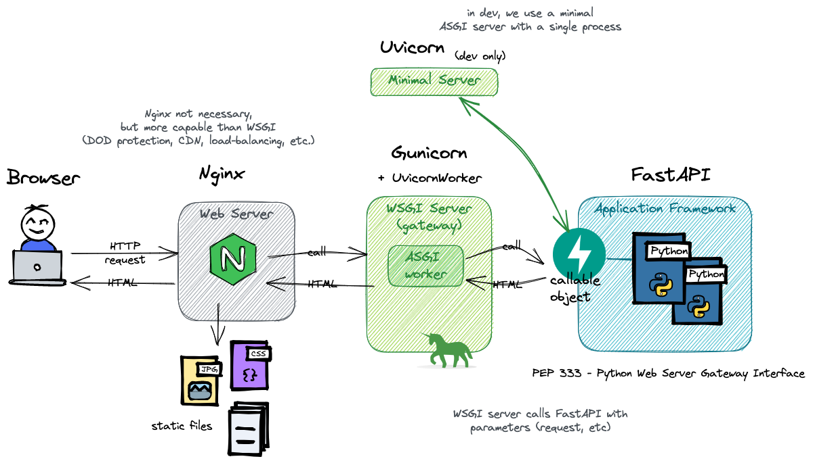

# FastAPI

[FastAPI](https://fastapi.tiangolo.com) is:
> a modern, fast (high-performance), web framework for building APIs with Python 3.7+ based 
> on standard Python type hints.

Their documentation is amazing (way better than this one), so please check it out!

[FastAPI docs](https://fastapi.tiangolo.com){ .md-button }


## About WSGI and ASGI

It is important to understand that FastAPI is an ASGI Application Framework. It cannot serve anything
by itself: it needs an ASGI Server (or a WSGI server with an ASGI worker).

[WSGI](https://www.fullstackpython.com/wsgi-servers.html) stands for *Web Server Gateway Interface*,
and ASGI for *Asynchronous Server Gateway interface*.
They both specify an interface that sits in between a web server and a Python web application or framework.
WSGI has been around for a long time. ASGI is a spiritual successor to WSGI, that is able to handle
asynchronous requests and responses.

In short, an **(A|W)SGI Server** is a web server that is able to call python code when it receives an HTTP request.
The way it calls this code, and what parameters are passed to the calling function, are all specified in the
(A|W)SGI interface specification. It includes information about the request and the environment.

It is then the role of the **(A|W)SGI Application** to build the headers and to return the data as iterable.
This is done using the `start_response` call. Here is a simple WSGI application
([source](http://ivory.idyll.org/articles/wsgi-intro/what-is-wsgi.html)):

```python
def simple_app(environ, start_response):
    status = '200 OK'
    response_headers = [('Content-type','text/plain')]
    # Actually start sending data back to the server
    start_response('200 OK', response_headers)
    return ['Hello world!\n']
```

This `simple_app` can then be passed to a server and be served as is.

Of course, apps are usually way more complex, with routing, proxies and complex logic involved.
This is why we use **(A|W)SGI Application Frameworks** such as FastAPI. Those frameworks have a single
entry point (that is called by the server), and lots of conveniences to abstract the complexities of
constructing responses, handling errors, doing redirects, determining which code to execute, etc.



To actually run a FastAPI app, we thus need an ASGI server (or a WSGI server with an ASGI-compatible worker).
In development, we can use [uvicorn](https://uvicorn.org/) - a minimalist server with a single process.

While a single process is enough for testing, it is not suitable for production.
The most common production setup for FastAPI is [gunicorn](https://gunicorn.org/)
with [uvicorn workers](https://fastapi.tiangolo.com/deployment/server-workers/), sitting behind
a reverse proxy such as [Nginx](https://www.nginx.com/).

Why the reverse proxy you ask? 
Gunicorn is amazing at handling workers and WSGI-specific things, while NGINX is a full-featured
HTTP server, able to handle millions of concurrent connections, provide DoD protection,
rewrite headers, and serve static resources more effectively.
Together, they form the perfect team.


See also: [The Layered World Of Web Development: Why I Need NGINX And UWSGI To Run A Python App?](
http://www.ines-panker.com/2020/02/16/nginx-uwsqi.html)

## Install FastAPI + uvicorn

Anyway, to get started, we only need to install both FastAPI and uvicorn:
```bash
poetry add fastapi
poetry add 'uvicorn[standard]'
```

The uvicorn server can then be launched (with reload!) using:
```bash
uvicorn package.filename:app_object --reload
```


## Getting started

Create a file `fastapi_celery/main.py` and add:

```python
from fastapi import FastAPI
from typing import Dict 

app = FastAPI() # <- the ASGI entrypoint

@app.get('/')
def index() -> Dict:
    return {'greating': 'hello'}
```

Run uvicorn with reload:
```bash
uvicorn fastapi_celery.main:app --reload
```

!!! Note

    It is also possible to run uvicorn directly from the python file,
    to allow for debugging:
    ```python
    import uvicorn


    if __name__ == "__main__":
        uvicorn.run(app, host="0.0.0.0", port=8000)
    ```

    If you use `reload=True`, however, you have to pass the `app` as an import string,
    in our case `celery_fastapi.main:app`.

and try it using:
```bash
curl http://localhost:8000/
```

Congrats! You have successfully coded a REST API.

Now, open the following in your browser: `http://localhost:8000/docs`.
FastAPI comes built-in with a [Swagger UI](https://swagger.io/tools/swagger-ui/)
the [OpenApi](https://spec.openapis.org/oas/latest.html) specification for us based on type hints.

Want more? FastAPI also comes with a [ReDoc](https://github.com/Redocly/redoc)
documentation: `http://localhost:8000/redoc`!

In short, you get those endpoints for free:

* `/docs` → Interactive API docs (Swagger UI)
* `/redoc` → Alternative API docs (ReDoc documentation)
* `/openapi.json` → OpenAPI spec (JSON document)

## A simple example

Let's imagine we want an endpoint to create a new user.
Let's start with the most basic thing, we'll improve later.

```python
from fastAPI import FastAPI
from typing import Any
from datetime import datetime

app = FastAPI

@app.get("/")
def create_user() -> dict[str, Any]:
    return {"id": 10, "name": "my-username", "created_at": datetime.now()}
```

Now, looking at the docs, there is not much detail. Let's make it better!

### Documentation

We can easily add some description for the endpoint using either a docstring,
or the `description` parameter on the annotation. The annotation also lets us
describe the response type. Both support markdown!

```python
@app.get('/', response_description="The `new` user")
def create_user() -> dict[str, Any]:
    """
    Create a new user. *Supports `markdown`!*
    """
```

For more documentation options:

* [Metadata and Docs URLs](https://fastapi.tiangolo.com/tutorial/metadata/)
  for general information,
* [Path Operation Configuration](https://fastapi.tiangolo.com/tutorial/path-operation-configuration/)
  for endpoint annotations,
* [Declare Request Example Data](https://fastapi.tiangolo.com/tutorial/schema-extra-example/)
  for extra schema samples. 

FastAPI allows describing pretty much anything, and to customize all the fields
that will appear in the OpenAPI spec. From now on, always look at the parameters
offered by FastAPI classes :fontawesome-regular-face-grin-wink:.

### Model class

The return type being a dictionary, FastAPI cannot give much detail, nor do
any validation. Let's change this by using a [pydantic](https://docs.pydantic.dev)
model.

First, install pydantic:
```bash
poetry add pydantic
```

And change the code to:

```py hl_lines="2 4 9-12 16-17"
from fastapi import FastAPI
from pydantic import BaseModel
from datetime import datetime
from random import randint

app = FastAPI()


class UserOut(BaseModel):
    id: int = randint(1, 100)
    name: str
    creation_date: datetime = datetime.now()


@app.get('/')
def create_user() -> UserOut:
    return UserOut(name="lucy")
```

Have a look at the successful response example in the docs. Isn't it great?

### Query parameters

The name is still hard-coded. Why not use a query parameter instead?

```py
@app.get("/")
def create_user(name: str) -> UserOut:
    return UserOut(name=name)
```

Since `name` doesn't have a default, it is marked as *required* in the interface,
and omitting it will throw an error.

A name, though usually has more than one letter, right? So let's add some validation.
For this, we can use the brand new feature of FastAPI 0.95.0: the support for 
[`typing.Annotated`](https://docs.python.org/3/library/typing.html#typing.Annotated)!

```py
from fastapi import FastAPI, Query
from typing import Annotated

# ...

@app.get("/")
def create_user(name: Annotated[str, Query(min_length=3)]) -> UserOut:
    return UserOut(name=name)
```

`Annotated` is here to decorate existing types with context-specific data.
Its first argument is always the final type, followed by varyadic arguments.
Those metadata arguments are then used by other tools, in our case FastAPI.

The `Query` object is a simple decorator offered by FastAPI that allows
adding constraints to a query parameter. I will let you dive into the capabilities
of `Query` on your own!

### Path parameters

Let's say, for some reason, you want the name to become a *path parameter*.
Suffice to change the path in the annotation:
```python
@app.get("/{name}")
```

If you are using simple parameters (`name: str`), all is fine. If you have some
constraints, though, you need to change the `Query` from the last example
with `Path`. The logic, however, stays the same:

```python
@app.get("/{name}")
def create_user(name: Annotated[str, Path(min_length=3)]) -> UserOut:
    return UserOut(name=name)
```

### Body parameters

Using a get to create a user is ugly. Furthermore, we may want to have more
information from the user such as a password. Let's fix this!

```py hl_lines="2 10-12 22 24"
from fastapi import FastAPI
from pydantic import BaseModel, Field
from datetime import datetime
from random import randint
from typing import Annotated

app = FastAPI()


class UserIn(BaseModel):
    name: Annotated[str, Field(example="my-username", min_length=3, regex="^[a-z-]+$")]
    password: Annotated[str, Field(example="secret", min_length=5)]


class UserOut(BaseModel):
    id: int = randint(1, 100)
    name: str
    creation_date: datetime = datetime.now()


@app.post("/")
def create_user(user: UserIn) -> UserOut:
    # return user <- would work as well... Try it!
    return UserOut(**user.dict())
```

As you can see, we can use `Field` on the properties of a pydantic model as we
do with `Query` and `Path`. Most of the properties are the same!

The type hints are enough for FastAPI to provide validation, proper documentation,
and IDE support.

More interestingly, FastAPI/pydantic takes care of the "views". What do I mean by that?
Try returning the input user directly (`return user`). We would expect to see `username`
and `password` in the results, right? No! FastAPI ensures that what is returned matches
the response model. Any extra properties are gone. There is no way the password will show
up in the response.
This allows for a flexible and elegant class hierarchy.

Even cooler, we can fine-tune what is returned using `response_model_exclude_none`
or `response_model_exclude_unset` in the `@app.post()` annotation.
If set to true, `None` values or default values won't be returned, respectively.

Have a look at all the other options, they are interesting :fontawesome-regular-face-smile:!


### Exceptions

If something goes wrong, simply raise an `HTTPException` class:

```python
from fastapi import FastAPI, HTTPException

app = FastAPI()

@app.get('/error')
def error():
    raise HTTPException(status_code=500, detail="Just throwing an internal server error")
```

Just try it:
```bash
curl http://localhost:8000/error -v
# < HTTP/1.1 500 Internal Server Error
# {"detail":"Just throwing an internal server error"}
```

Note that the `detail` can be of any type, not just string. As long as it is JSON-serializable!
It is also possible to specify headers.

### Status code

Since our method creates a user, it would be better to return a `201 - Created` instead of a
`200 - OK`. Again, no need to look further, just specify the `status_code` parameter!

```python
@app.post("/", status_code=201)
```

## Other awesome features

* You can add [examples and example schemas](https://fastapi.tiangolo.com/tutorial/schema-extra-example/)
  that will show up in the UI at all levels. Even better, you can have multiple examples for a body,
  and the UI will show you a dropdown you can choose from!
* FastAPI supports lots of [types](https://docs.pydantic.dev/usage/types/) out-of-the-box!
  By supporting, I mean automatic parsing and validation :fontawesome-regular-face-grin-wink:.
  The [pydantic types](https://docs.pydantic.dev/usage/types/#pydantic-types) are especially useful.
  Some examples: `EmailStr`, `Color`, `FilePath`, `PastDate`, `HttpUrl`, `SecretStr` (won't be logged), etc.
* The body can be composed: if we add multiple models as parameters, FastAPI will merge them together.
  For example, declaring:
  ```python
  def some_post(admin_user: User, regular_user: User):
  ```
  will expect an input like this:
  ```json
  {"admin_user": {}, "regular_user": {}}
  ```
  This avoids the necessity to create extra classes just for composition!
* Model classes based on pydantic's `BaseModel`, which has lots of awesome features.
  For example, the methods `.dict()`, `.json()` and `.copy()` come out-of-the-box, and
  support including, excluding and renaming fields (among other).
  More info [here](https://docs.pydantic.dev/usage/exporting_models/#modeldict).
* To avoid hard-coding HTTP status codes, use FastAPI's `status.HTTP_*` constants.
* The [`json_encoder()`](https://fastapi.tiangolo.com/tutorial/encoder/?h=jsonable_encoder#using-the-jsonable_encoder)
  will convert dict, pydantic models, etc. into valid JSON, a bit like `json.dumps`. But contrary to the latter,
  the result is not a string, but a dictionary with all values compatible with JSON (think of `datetime` objects).
* For bigger applications, FastAPI uses `APIRouter`, which is equivalent to blueprints in Flask.
  For more information, read [Bigger Applications - Multiple Files](https://fastapi.tiangolo.com/tutorial/bigger-applications).
* FastAPI has a very powerful but intuitive Dependency Injection system (DI). This can be used to have shared logic,
  share database connections, enforce security (e.g. checking the presence of a valid JWT token), etc.
  See [Dependencies - First Steps](https://fastapi.tiangolo.com/tutorial/dependencies/).

And so much more!