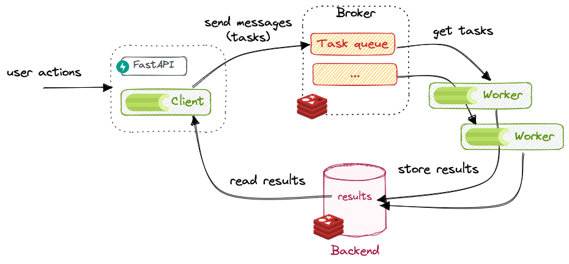

# Celery

Celery is a task queue with focus on real-time processing, while also supporting task scheduling.

## What is Celery

From their documentation:

> Task queues are used as a mechanism to distribute work across threads or machines.
> A task queue’s input is a unit of work called a **task**.
> Dedicated **worker processes** constantly monitor task queues for new work to perform.
> 
> Celery communicates via **messages**, usually using a **broker** to mediate between clients and workers.
> To initiate a task the **client** adds a message to the queue, the broker then delivers that message to a worker.
> 
> A Celery system can consist of multiple workers and brokers, giving way to high availability and horizontal scaling.
> [it] is written in Python, but the protocol can be implemented in any language [(current clients in NodeJS, PHP)].




In other words, the entities involved in Celery are:

* __producers__: also called __clients__, they are the ones requesting tasks and doing something with the results.
* __broker__: the broker is the message transport, used to send and receive messages between producers and workers.
  In other words, they store the __task queue__. Celery supports a myriad of message brokers,
  but currently only two are feature-complete: :simple-redis: [Redis](https://redis.io/) and 
  :simple-rabbitmq: [RabbitMQ](https://www.rabbitmq.com/).
* __workers__: the workers are processes that constantly watch the task queue and execute tasks.
* __result backend__: a backend is only necessary when we want to keep track of the tasks' states or retrieve results from tasks.
  A result backend is optional but turned on by default,
  see [Celery without a Results Backend](https://patrick.cloke.us/posts/2019/07/17/celery-without-a-results-backend/).


See also the diagram in [Understanding Celery's architecture](https://subscription.packtpub.com/book/programming/9781783288397/7/ch07lvl1sec45/understanding-celerys-architecture)
  
### Getting started

First, we need a *broker* and a *backend*. We will use redis, as it is both full-featured and easy to use:
```bash
poetry add 'celery[redis]'
```

We can run redis locally using:
```bash
docker run --rm --name some-redis -p 6379:6379 redis:latest
```

Now, let's create a task. We first need to create a **Celery instance**, which is the entrypoint to Celery:
may it be submitting tasks (client), managing workers, getting results, etc. We usually call it the Celery
application, or app for short.

```python
from celery.app import Celery

redis_url = os.getenv("REDIS_URL", "redis://localhost:6379")

celery_app = Celery(__name__, broker=redis_url, backend=redis_url)
```

Now, let's define a dummy *task*, that will create a file with a timestamp:

```python
# in file task.py
from celery.app import Celery
from datetime import datetime
import os

redis_url = os.getenv("REDIS_URL", "redis://localhost:6379")

app = Celery(__name__, broker=redis_url, backend=redis_url)


@app.task
def dummy_task():
    folder = '/tmp/celery'
    os.makedirs(folder, exist_ok=True)
    now = datetime.now().strftime("%Y-%m-%dT%H:%M:%s")
    with open(f"{folder}/task-{now}.txt", "w") as f:
        f.write("hello!")
```

To check it works, let's call it directly using the Python REPL (`python`):

```python
>>> import fastapi_celery.task
>>> task.dummy_task()
```
This should create the file - we called it directly, so Celery was not involved. To execute
this task using Celery, we need to use one of the methods that were added by the decorator
(see [calling tasks](https://docs.celeryq.dev/en/stable/userguide/calling.html#guide-calling)).
The most common is `delay()`, which is a shortcut to `apply_async()`. Those methods will return
an `AsyncResult`, that can be further used to query the status.

```python
>>> t = task.dummy_task.delay()
>>> t.status
PENDING
```

Why is it pending? Well, we didn't launch any workers did we? Let's change that. In another terminal, run:
```bash
celery --app=fastapi_celery.task.app worker --concurrency=1 --loglevel=DEBUG
```

Now, try again:
```python
>>> task.status
SUCCESS
```

To ensure this works, try adding a delay in the task: `time.sleep(10)`. Don't forget to restart the worker, as the
method definition changed! Even better, use `watchdog` to automatically restart the worker:
```bash
poetry add watchdog --group=dev
watchmedo auto-restart --directory=./fastapi_celery --pattern=task.py -- celery --app=fastapi_celery.task.app worker --concurrency=1 --loglevel=DEBUG
```

## Parameters and return values

Now, let's change a bit our dummy task so it receives an argument and returns a result:
```python
def dummy_task(name='Bob') -> str:
    sleep(5)
    return f'Hello {name}!'
```

```python
>>> import importlib
>>> importlib.reload(task)
>>> t = task.dummy_task.delay('Lucy')
>>> t.result # empty until sucess
>>> t.result
'Hello Lucy!'
```

Try to return a dictionary instead. It should work the same. But what about this?

```python
def dummy_task() -> str:
    return open('/tmp/celery/x.txt', 'w')
```

```python
>>> t = task.dummy_task.delay()
>>> t.status
'FAILURE'
>>> t.result
EncodeError("TypeError('Object of type TextIOWrapper is not JSON serializable')")
t.successful()
False
```

So beware: results must be JSON-serializable (or match the serialization configured in Celery), since the results
will be serialized and stored in the results backend.

## Using Celery with FastAPI

With those building blocks, we can now bind the two together. We simply import `task.py` in FastAPI,
and call our `task.delay()` from a REST call. We can return the task ID and its status to the user:

```python
from fastapi import FastAPI, HTTPException
from pydantic import BaseModel

from . import task

app = FastAPI()


class TaskResponse(BaseModel):
    id: str
    status: str


@app.get("/start")
def start() -> TaskResponse:
    t = task.dummy_task.delay()
    return TaskResponse(id=t.task_id, status=t.status)


@app.get("/status")
def status(id: str) -> TaskResponse:
    t = task.app.AsyncResult(id)
    return TaskResponse(id=id, status=t.status)
```


## Restricting to one task at a time

Celery doesn't provide an obvious way to limit the number of concurrent tasks.
In our use case, we want to only have one task executed at a time. If the user tries
to start a task while another is already running, he should get an error.

With multithreading/multiprocessing, a common construct is the mutual exclusion (*mutex*) lock.
The thing is, we have multiple processes here, so we need a lock that lives outside the Python
process.

As we already have Redis, we can use a [Redis Lock](https://redis-py.readthedocs.io/en/v4.1.2/lock.html)!
But how do we use it?

Ideally, we would like to get the lock when we start a task (from the REST endpoint - FastAPI), and release
it when the task is finished (from the Celery worker). But a lock should be acquired and released from the
same thread... And worse, if our worker fails to release the lock, we are stuck!

A better way is to use the lock from FastAPI only. We cannot know when the task is finished, but we can query
the state of a task given an ID. So let's use the lock to secure the read/write to a Redis key, `current_task_id`,
which holds the ID of the last task!

This way, the REST endpoint:

1. acquires the lock
2. reads the last task id from Redis
3. queries the status of the task
4. if the task is still pending, throws an error, if it is finished:
    * launches a new task
    * stores the new ID in Redis
5. releases the lock

Cherries on the cake, endpoints such as `/status` can return the status of the last task by default,
so users do not have to supply a value on each call.

So, for the implementation, let's first create a redis lock:

```python
from redis import Redis
from redis.lock import Lock as RedisLock

redis_instance = Redis.from_url(worker.redis_url)
lock = RedisLock(redis_instance, name="task_id")

REDIS_TASK_KEY = "current_task"
```

The `/start` endpoint now looks like this:

```python
@app.get("/start")
def start() -> TaskResponse:
    try:
        if not lock.acquire(blocking_timeout=4):
            raise HTTPException(status_code=500, detail="Could not acquire lock")

        id = redis_instance.get(REDIS_TASK_KEY)
        if id is None or worker.app.AsyncResult(id).status in ("SUCCESS", "FAILURE"):
            # no task was ever run, or the last task finished already
            t = task.dummy_task.delay()
            redis_instance.set(REDIS_TASK_KEY, t.id)
            return TaskResponse(id=t.task_id, status=t.status)
        else:
            # the last task is still running!
            raise HTTPException(
                status_code=400, detail="A task is already being executed"
            )
    finally:
        lock.release()
```

And for the `/status`, we can now make the `id` query parameter optional:

```python
@app.get("/status")
def status(id: str = None) -> TaskResponse:
    id = id or redis_instance.get(REDIS_TASK_KEY)
    if id is None:
        raise HTTPException(status_code=400, detail="Could not determine task id")
    t = task.app.AsyncResult(id)
    return TaskResponse(id=id, status=t.status)
```

## Canceling long-running tasks

Maybe we want to cancel the current task. How can we do it?

The Celery app gives us access to [control](), which lets us get statistics,
how many workers are running, etc.

```python

from . import task

task.app.control.revoke(task_id, terminate=True, signal="SIGKILL")
```