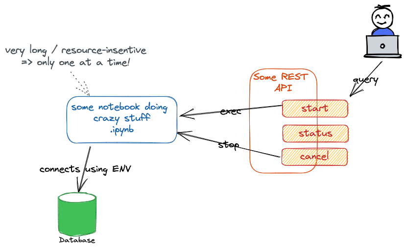

# FastAPI + Celery = ♥

Hello there!

*Interested in Python FastAPI? Wondering how to execute long-running tasks in the background
in Python? You came to the right place!*

This little website will go through the basics of Poetry, FastAPI and Celery, with some detours
here and there.

!!! Note

    I built this website for a talk given at the GDG Fribourg in **March 2023**.
    Please keep that in mind: the technologies may have evolved a little.
    Versions used at the time of writing: poetry `1.3.0`, FastAPI `0.94.*`, Celery `5.2.*`

I learned about FastAPI and Celery when confronted with a simple yet interesting use case:

I had a Jupyter Notebook that connected to a database, ran some heavy processing on
the data (using machine learning and everything) and saved aggregated data back to
the database. Since notebooks are great for developing, the requirement was to keep
using Notebooks, *but* to be able to trigger the processing from an API call.
The notebook should never be executed twice in parallel though: the API should thus
return an error if the notebook was already being executed.

I was initially planning to use a simple Flask app, but soon got into trouble:
how can I (1) run the notebook in a background thread and (2) restrict its
execution to one at a time?

The solution will be explained on those pages. If you are only interested in
the final implementation, have a look at my nb-runner project on GitHub:

[:simple-github: fastapi-notebook-runner](https://github.com/derlin/fastapi-notebook-runner){ .md-button }

